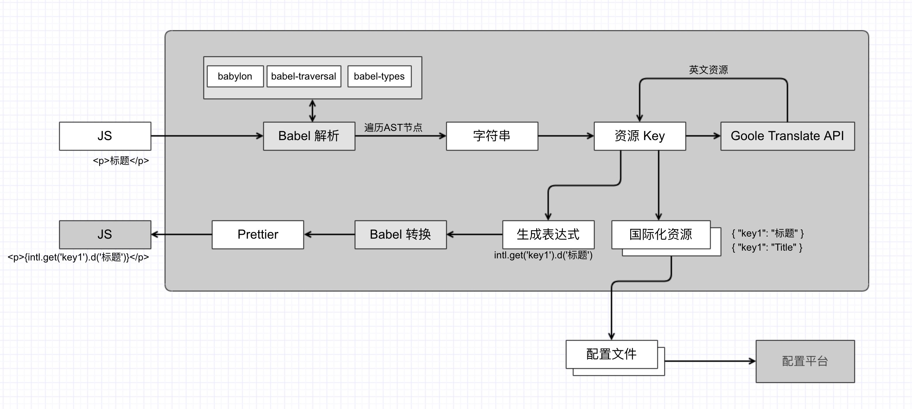

# di18n

自动转换、基于配置的前端国际化方案。

## 为什么存在

在前端国际化开发中，很多社区方案给我们带来了极大便利，但是仍有2个问题没有解决：

- 需要手工将代码中的主语言（比如中文）替换成国际化标记；
- 语言包应该是一种配置，不必强耦合到项目代码里。

为此，我们开发了 **di18n**，它能自动扫描代码中的主语言，将其替换成国际化标记；同时将语言抽取成配置，可以放到服务端保存及更新。

## 工作原理

di18n 会先按如下步骤扫描源码：

- 使用 Babel 解析得到 AST，遍历 AST，并对特殊的节点进行检查，抽取出需要翻译的字符串；
- 自动为每一个字符串分配一个 key；
- 自动调用 Google 翻译服务（可选），得到一个英文的字符串。

> 注：对于 React，上面提到的特殊节点包括： `JSXText` `StringLiteral` `TemplateLiteral` 等。

扫描之后，对于源代码：

- 构造 `CallExpression` 表达式 `intl.get('key1').d('xxx');`；
- 替换原有节点 `path.replaceWith(newNode)`；
- 将新的 AST 通过 Babel 转换为代码；
- 使用 Prettier 格式化代码；
- 将新的代码落盘。

对于国际化资源：

- 将 key-value 转换为 i18n 配置文件格式。

## 流程图



## 安装

```
$ npm i -D di18n-cli

# or

$ yarn add  -D di18n-cli
```

## 初始化

```
$ npx di18n init
```

## 同步

```
$ npx di18n sync
```

## 发布

```
$ npx di18n publish
```

## License

[MIT](https://opensource.org/licenses/MIT)
