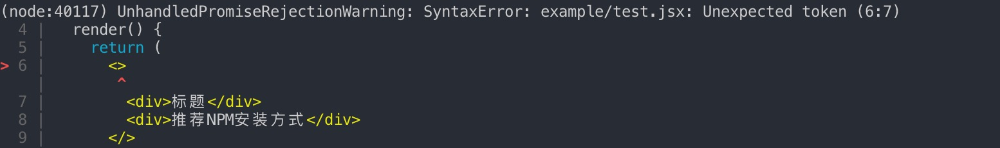

# 常见问题

## 解析错误



由于 babel6.x 暂时不支持这种写法，参考 [https://reactjs.org/blog/2017/11/28/react-v16.2.0-fragment-support.html#babel](https://reactjs.org/blog/2017/11/28/react-v16.2.0-fragment-support.html#babel)
目前暂时只能改为：

```jsx
<React.Fragment>
  <div>标题</div>
  <div>推荐NPM安装方式</div>
</React.Fragment>
```

## 如何排除一些代码不被扫描

默认情况下，entry 指定的文件夹内所有的 js 或者 jsx 代码都将被扫描，如何控制一些代码不被扫描？

我们提供了不同粒度的排除配置能力，可以根据不同的应用场景，选择一个合适的配置项：

- 文件级别： [exclude](../config/#exclude)
- 组件级别： [ignoreComponents](../config/#ignorecomponents)
- 方法级别： [ignoreMethods](../config/#ignoremethods)
- 代码级别： [ignoreComments](../config/#ignorecomments)
